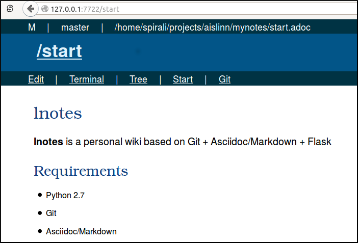

= lnotes

*lnotes* is a personal wiki based on Git + Asciidoctor/Markdown + Flask

== Requirements

 * Python 2.7
 * Git
 * Asciidoctor/Markdown (Not Asciidoc!)

== Installation (optional)

    $ python setup.py build
    $ python setup.py install

== How to use lnotes

Make a git repository:

    git init mynotes

When 'lnotes' are installed, run the following:

    cd mynotes
    python -m lnotes

*OR* runnning 'lnotes' without installation

    cd mynotes
    python /path/to/lnotes/src/lnotes.py

'lnotes' are now running at http://127.0.0.1:7722
Configuration can be changed in +mynotes/.lnotes.conf+

== Author

Stanislav Böhm (stanislav.bohm /at/ vsb  /dot/ cz)
